# NotePad

## 一、项目概述
本项目是基于 Android 平台的记事本应用，在原生记事本功能基础上，扩展了时间戳显示、笔记搜索、背景主题颜色设置、分类管理、多维度排序与筛选功能，实现了更高效、个性化的笔记管理体验。应用采用 ContentProvider 实现数据持久化，遵循 Android 组件化开发规范，UI 风格简洁直观。
### （一）初始应用功能
**1. 新建和编辑笔记**
   
新建笔记：点击主界面右上角新建按钮，创建新笔记

编辑笔记：点击任意笔记条目进入编辑界面，支持富文本编辑

**2. 编辑标题**
   
在笔记编辑界面点击菜单，选择"Edit title"可单独编辑笔记标题

**3. 笔记列表**

显示所有笔记的标题列表
初始应用采用黑色背景，白色文字显示

### （二）基本功能
 1. 笔记条目增加时间戳显示
 2. 笔记搜索功能
### （三）扩展功能
 1. 笔记背景主题颜色设置
 2. 笔记分类管理
 3. 多重筛选功能
 4. 高级排序功能
### （四）项目结构说明
```java
            
src/
├── main/
│   ├── java/com/example/android/notepad/
│   │   ├── NotePad.java          # 数据库契约类
│   │   ├── NotePadProvider.java  # 内容提供者
│   │   ├── NotesList.java        # 主列表活动
│   │   ├── NoteEditor.java       # 编辑活动
│   │   └── TitleEditor.java      # 标题编辑活动
│   ├── res/
│   │   ├── layout/               # 布局文件
            ├── note_editor.xml   # 编辑页面布局
│   │       ├── noteslist_item.xml# 列表项布局
│   │       ├── title_editor.xml  # 标题编辑布局
│   │   ├── menu/                 # 菜单文件
│   │   ├── values/               # 资源文件
            ├── colors.xml        # 颜色资源（含笔记背景色）
│   │       ├── strings.xml       # 字符串资源
│   │       ├── styles.xml        # 主题样式
│   │   └── drawable/             # 图形资源
│   └── AndroidManifest.xml       # 应用清单

```
## 二、基本功能实现
### （一）笔记条目时间戳显示
 ###  1. 功能说明
每个新建笔记自动保存创建时间，修改笔记后更新时间戳为最新修改时间

时间格式为yyyy-MM-dd HH:mm，直观展示笔记更新状态。
###  2. 技术实现步骤
步骤一：数据库字段定义（NotePad.java）
```Java
public static final class Notes implements BaseColumns {
  
    public static final String COLUMN_NAME_CREATE_DATE = "created";

    public static final String COLUMN_NAME_MODIFICATION_DATE = "modified";
}
```
步骤二：数据库表创建（NotePadProvider.java）
```java
@Override
public void onCreate(SQLiteDatabase db) {
    db.execSQL("CREATE TABLE " + NotePad.Notes.TABLE_NAME + " ("
            + NotePad.Notes._ID + " INTEGER PRIMARY KEY,"
            + NotePad.Notes.COLUMN_NAME_TITLE + " TEXT,"
            + NotePad.Notes.COLUMN_NAME_NOTE + " TEXT,"
            + NotePad.Notes.COLUMN_NAME_CREATE_DATE + " INTEGER,"
            + NotePadjava.Notes.COLUMN_NAME_MODIFICATION_DATE + " INTEGER,"
            + NotePad.Notes.COLUMN_NAME_CATEGORY + " TEXT,"
            + NotePad.Notes.COLUMN_NAME_COLOR + " INTEGER DEFAULT 0,"
            + NotePad.Notes.COLUMN_NAME_TAGS + " TEXT"
            + ");");
}
```
步骤三：插入时自动添加时间戳（NotePadProvider.java）
```java
@Override
public Uri insert(Uri uri, ContentValues initialValues) {
    // Gets the current system time in milliseconds
    Long now = Long.valueOf(System.currentTimeMillis());

    // If the values map doesn't contain the creation date, sets the value to the current time.
    if (values.containsKey(NotePad.Notes.COLUMN_NAME_CREATE_DATE) == false) {
        values.put(NotePad.Notes.COLUMN_NAME_CREATE_DATE, now);
    }

    // If the values map doesn't contain the modification date, sets the value to the current
    // time.
    if (values.containsKey(NotePad.Notes.COLUMN_NAME_MODIFICATION_DATE) == false) {
        values.put(NotePad.Notes.COLUMN_NAME_MODIFICATION_DATE, now);
    }
}
```
步骤四：笔记列表显示时间戳（NotesList.java）
```java
// 时间格式化方法
private String formatDate(long timeMillis) {
    SimpleDateFormat sdf = new SimpleDateFormat("yyyy-MM-dd HH:mm", Locale.getDefault());
    return sdf.format(new Date(timeMillis));
}

// 在setViewBinder中处理时间显示
adapter.setViewBinder(new SimpleCursorAdapter.ViewBinder() {
    @Override
    public boolean setViewValue(View view, Cursor cursor, int columnIndex) {
        if (view.getId() == R.id.note_time) {
            TextView textView = (TextView) view;
            long timeMillis = cursor.getLong(columnIndex);
            String timeStr = formatDate(timeMillis);
            textView.setText(timeStr);
            textView.setTextColor(getResources().getColor(R.color.secondary_text));
            return true;
        }
        return false;
    }
});
```
步骤五：布局文件添加时间显示控件（noteslist_item.xml）
```xml
<TextView
    android:id="@+id/note_time"
    android:layout_width="match_parent"
    android:layout_height="wrap_content"
    android:textAppearance="?android:attr/textAppearanceSmall"
    android:textColor="@color/secondary_text"
    android:layout_marginTop="2dp" />
```
###  3. 效果截图
修改笔记后更新时间戳为最新修改
时间格式为yyyy-MM-dd HH:mm

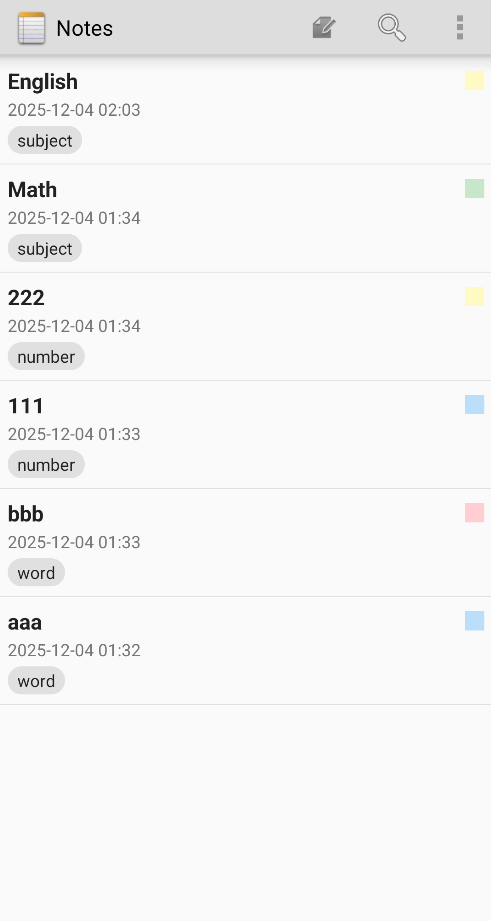

### （二）笔记搜索功能
 ###  1. 功能说明
支持按标题和内容关键字搜索

实时搜索，输入时自动过滤结果

清空搜索条件显示所有笔记
 ###  2. 技术实现步骤
 步骤一：添加搜索菜单项（list_options_menu.xml）
 ```properties
<menu xmlns:android="http://schemas.android.com/apk/res/android">
    <item android:id="@+id/menu_search"
        android:icon="@android:drawable/ic_menu_search"
        android:title="Search"
        android:showAsAction="ifRoom|withText" />
</menu>
```
步骤二：实现搜索功能（NotesList.java）
 ```java
// 搜索相关方法
private void performSearch() {
    mCurrentSearchQuery = mSearchEditText.getText().toString().trim();
    refreshList();
}

private void refreshList() {
    String selection = null;
    String[] selectionArgs = null;
    List<String> selectionList = new ArrayList<>();
    List<String> argsList = new ArrayList<>();

    if (mCurrentSearchQuery != null && !mCurrentSearchQuery.isEmpty()) {
        selectionList.add("(" + NotePad.Notes.COLUMN_NAME_TITLE + " LIKE ? OR "
                + NotePad.Notes.COLUMN_NAME_NOTE + " LIKE ?)");
        argsList.add("%" + mCurrentSearchQuery + "%");
        argsList.add("%" + mCurrentSearchQuery + "%");
    }

    if (!selectionList.isEmpty()) {
        selection = TextUtils.join(" AND ", selectionList);
        selectionArgs = argsList.toArray(new String[0]);
    }

    Cursor cursor = managedQuery(
            getIntent().getData(),
            PROJECTION,
            selection,
            selectionArgs,
            mCurrentSortOrder
    );

    SimpleCursorAdapter adapter = (SimpleCursorAdapter) getListAdapter();
    adapter.changeCursor(cursor);
    adapter.notifyDataSetChanged();
}
```
步骤三：添加搜索菜单处理（NotesList.java）
 ```java
@Override
public boolean onOptionsItemSelected(MenuItem item) {
    int id = item.getItemId();
    
    if (id == R.id.menu_search) {
        showSearchDialog();
        return true;
    }
    
    // 其他菜单处理...
}
private void showSearchDialog() {
    AlertDialog.Builder builder = new AlertDialog.Builder(this);
    builder.setTitle("搜索笔记");

    final EditText input = new EditText(this);
    input.setHint("输入标题或内容关键字");
    builder.setView(input);

    builder.setPositiveButton("搜索", new DialogInterface.OnClickListener() {
        @Override
        public void onClick(DialogInterface dialog, int which) {
            mCurrentSearchQuery = input.getText().toString().trim();
            refreshList();
        }
    });

    builder.setNegativeButton("取消", null);
    builder.show();
}
```
步骤四：添加搜索布局文件（search_layout.xml）
 ```xml
<?xml version="1.0" encoding="utf-8"?>
<LinearLayout xmlns:android="http://schemas.android.com/apk/res/android"
    android:layout_width="match_parent"
    android:layout_height="wrap_content"
    android:orientation="horizontal"
    android:padding="8dp"
    android:background="@color/primary_color">

    <EditText
        android:id="@+id/search_edit_text"
        android:layout_width="0dp"
        android:layout_height="wrap_content"
        android:layout_weight="1"
        android:hint="搜索笔记..."
        android:inputType="text"
        android:maxLines="1"
        android:imeOptions="actionSearch"
        android:background="@drawable/search_background"
        android:padding="12dp" />

    <Button
        android:id="@+id/btn_search"
        android:layout_width="wrap_content"
        android:layout_height="wrap_content"
        android:layout_marginStart="8dp"
        android:text="搜索"
        android:background="@drawable/button_background" />

    <Button
        android:id="@+id/btn_clear"
        android:layout_width="wrap_content"
        android:layout_height="wrap_content"
        android:layout_marginStart="4dp"
        android:text="清除"
        android:background="@drawable/button_background" />
</LinearLayout>
```
 ###  3. 效果截图
##### 两种方式搜索：图标，侧栏

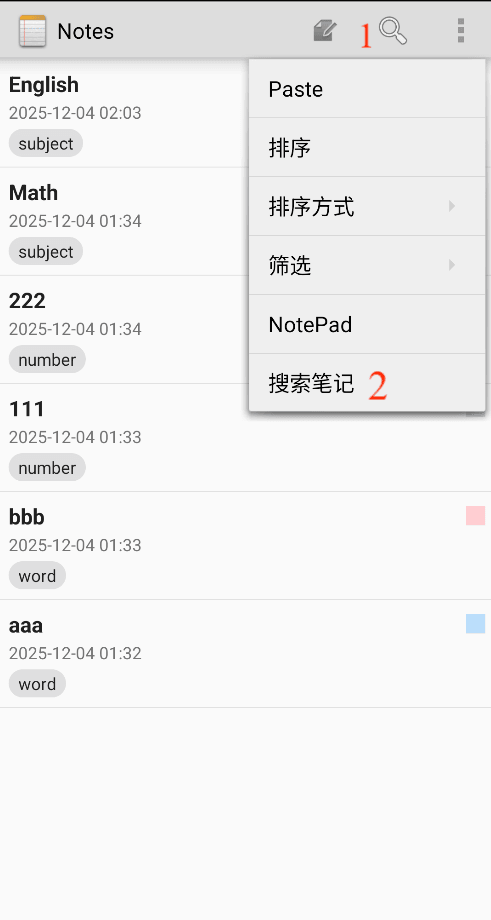

##### 按笔记名称搜索

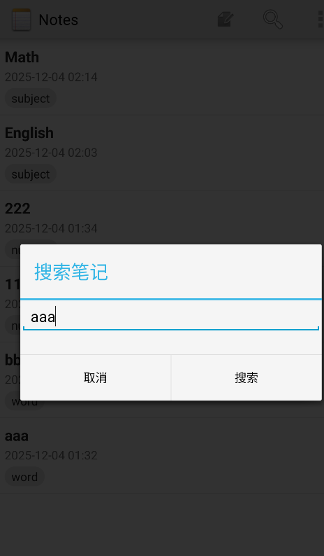 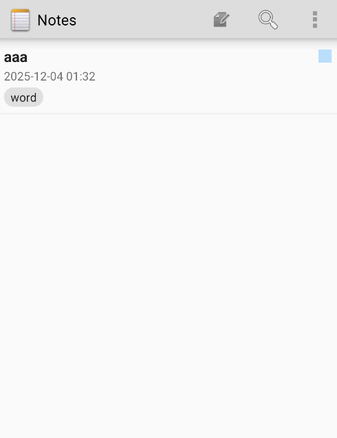

##### 按笔记内容搜索（9976）

 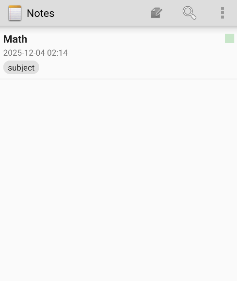
## 三、扩展功能实现
 ### （一）笔记背景主题颜色设置
 ###  1. 功能说明
支持6种颜色标记笔记

颜色在列表和编辑界面都可见
 ###  2. 技术实现步骤
步骤一：定义颜色常量（NotePad.java）
 ```java
public static final class Notes implements BaseColumns {
    // =========== 添加颜色常量 ===========
    public static final int COLOR_DEFAULT = 0;
    public static final int COLOR_RED = 1;
    public static final int COLOR_BLUE = 2;
    public static final int COLOR_GREEN = 3;
    public static final int COLOR_YELLOW = 4;
    public static final int COLOR_PURPLE = 5;
    public static final String COLUMN_NAME_COLOR = "color";
}
```
步骤二：数据库升级支持颜色字段（NotePadProvider.java
```java
private static final int DATABASE_VERSION = 4;

@Override
public void onUpgrade(SQLiteDatabase db, int oldVersion, int newVersion) {
    Log.d(TAG, "Upgrading database from version " + oldVersion + " to " + newVersion);

    if (oldVersion < 3) {
        // 升级到版本3，添加颜色字段
        db.execSQL("ALTER TABLE " + NotePad.Notes.TABLE_NAME
                + " ADD COLUMN " + NotePad.Notes.COLUMN_NAME_COLOR + " INTEGER DEFAULT 0");
        Log.d(TAG, "Added color column");
    }
}
```
步骤三：插入笔记时设置默认颜色（NotePadProvider.java
```java
@Override
public Uri insert(Uri uri, ContentValues initialValues) {
    if (values.containsKey(NotePad.Notes.COLUMN_NAME_COLOR) == false) {
        values.put(NotePad.Notes.COLUMN_NAME_COLOR, NotePad.Notes.COLOR_DEFAULT); // 默认白色
    }
}
```
步骤四：笔记列表显示颜色标记（NotesList.java）
```java
// 在setViewBinder中处理颜色显示
adapter.setViewBinder(new SimpleCursorAdapter.ViewBinder() {
    @Override
    public boolean setViewValue(View view, Cursor cursor, int columnIndex) {
        // 处理颜色圆点显示
        else if (view.getId() == R.id.note_color) {
            ImageView imageView = (ImageView) view;
            int colorValue = cursor.getInt(columnIndex); // 从数据库读取颜色值

            // 根据笔记的color值设置对应的背景色
            int backgroundColor;
            switch (colorValue) {
                case NotePad.Notes.COLOR_RED:
                    backgroundColor = getResources().getColor(R.color.color_red);
                    break;
                case NotePad.Notes.COLOR_BLUE:
                    backgroundColor = getResources().getColor(R.color.color_blue);
                    break;
                case NotePad.Notes.COLOR_GREEN:
                    backgroundColor = getResources().getColor(R.color.color_green);
                    break;
                case NotePad.Notes.COLOR_YELLOW:
                    backgroundColor = getResources().getColor(R.color.color_yellow);
                    break;
                case NotePad.Notes.COLOR_PURPLE:
                    backgroundColor = getResources().getColor(R.color.color_purple);
                    break;
                case NotePad.Notes.COLOR_DEFAULT:
                default:
                    backgroundColor = getResources().getColor(R.color.color_default);
                    break;
            }

            imageView.setBackgroundColor(backgroundColor);
            imageView.setVisibility(View.VISIBLE);
            return true;
        }
        return false;
    }
});
```
步骤五：编辑界面颜色设置（NoteEditor.java）
```java
private void setEditorBackground(int color) {
    switch (color) {
        case NotePad.Notes.COLOR_RED:
            mText.setBackgroundColor(getResources().getColor(R.color.color_red));
            break;
        case NotePad.Notes.COLOR_BLUE:
            mText.setBackgroundColor(getResources().getColor(R.color.color_blue));
            break;
        case NotePad.Notes.COLOR_GREEN:
            mText.setBackgroundColor(getResources().getColor(R.color.color_green));
            break;
        case NotePad.Notes.COLOR_YELLOW:
            mText.setBackgroundColor(getResources().getColor(R.color.color_yellow));
            break;
        case NotePad.Notes.COLOR_PURPLE:
            mText.setBackgroundColor(getResources().getColor(R.color.color_purple));
            break;
        default:
            mText.setBackgroundColor(getResources().getColor(R.color.card_background));
            break;
    }
}

private void showColorDialog() {
    AlertDialog.Builder builder = new AlertDialog.Builder(this);
    builder.setTitle("选择笔记颜色");

    final String[] colors = {"默认(白色)", "红色", "蓝色", "绿色", "黄色", "紫色"};
    final int[] colorValues = {NotePad.Notes.COLOR_DEFAULT, NotePad.Notes.COLOR_RED,
            NotePad.Notes.COLOR_BLUE, NotePad.Notes.COLOR_GREEN,
            NotePad.Notes.COLOR_YELLOW, NotePad.Notes.COLOR_PURPLE};

    builder.setSingleChoiceItems(colors, mCurrentColor, new DialogInterface.OnClickListener() {
        @Override
        public void onClick(DialogInterface dialog, int which) {
            mCurrentColor = colorValues[which];
            setEditorBackground(mCurrentColor);
            dialog.dismiss();
            Toast.makeText(NoteEditor.this, "颜色已设置", Toast.LENGTH_SHORT).show();
        }
    });

    builder.setNegativeButton("取消", null);
    builder.show();
}
```
步骤六：颜色资源文件（colors.xml）
```xml
<?xml version="1.0" encoding="utf-8"?>
<resources>
    <!-- 笔记颜色 -->
    <color name="color_default">#FFFFFF</color>
    <color name="color_red">#FFCDD2</color>
    <color name="color_blue">#BBDEFB</color>
    <color name="color_green">#C8E6C9</color>
    <color name="color_yellow">#FFF9C4</color>
    <color name="color_purple">#E1BEE7</color>
</resources>
```
 ###  3. 效果截图
##### 有六个颜色可选择

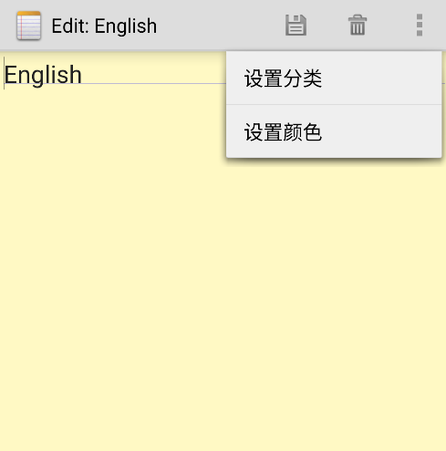 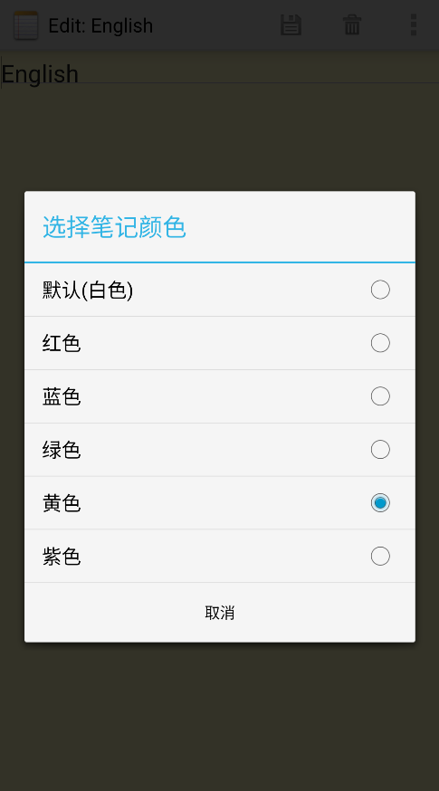
 ### （二）笔记分类管理
 ###  1. 功能说明
 为笔记设置分类标签

按分类筛选笔记

分类标签可视化显示
 ###  2. 技术实现步骤
 步骤一：添加分类字段定义（NotePad.java）
 ```java
public static final class Notes implements BaseColumns {
    /**
     * Column name for the note category
     * <P>Type: TEXT</P>
     */
    public static final String COLUMN_NAME_CATEGORY = "category";
}
```
步骤二：编辑界面分类设置（NoteEditor.java）
```java
private void showCategoryDialog() {
    AlertDialog.Builder builder = new AlertDialog.Builder(this);
    builder.setTitle("设置分类");

    final EditText input = new EditText(this);
    input.setText(mCurrentCategory);
    input.setHint("输入分类名称");
    builder.setView(input);

    builder.setPositiveButton("确定", new DialogInterface.OnClickListener() {
        @Override
        public void onClick(DialogInterface dialog, int which) {
            mCurrentCategory = input.getText().toString().trim();
            Toast.makeText(NoteEditor.this, "分类已设置: " + mCurrentCategory,
                    Toast.LENGTH_SHORT).show();
        }
    });

    builder.setNegativeButton("取消", null);
    builder.show();
}
```
步骤三：更新笔记时保存分类（NoteEditor.java）
```java
private final void updateNote(String text, String title) {
    ContentValues values = new ContentValues();
    
    // 添加分类
    if (mCurrentCategory != null && !mCurrentCategory.isEmpty()) {
        values.put(NotePad.Notes.COLUMN_NAME_CATEGORY, mCurrentCategory);
    }
    
    // 其他更新逻辑...
}
```
步骤四：笔记列表显示分类标签（NotesList.java）
```java
// 在setViewBinder中处理分类显示
adapter.setViewBinder(new SimpleCursorAdapter.ViewBinder() {
    @Override
    public boolean setViewValue(View view, Cursor cursor, int columnIndex) {
        // 处理分类显示
        else if (view.getId() == R.id.note_category) {
            TextView textView = (TextView) view;
            String category = cursor.getString(columnIndex);
            if (category != null && !category.isEmpty()) {
                textView.setText(category);
                textView.setVisibility(View.VISIBLE);
                // 设置分类标签样式
                textView.setBackgroundResource(R.drawable.category_background);
                textView.setTextColor(getResources().getColor(R.color.primary_text));
            } else {
                textView.setVisibility(View.GONE);
            }
            return true;
        }
        return false;
    }
});
```
步骤五：分类对话框布局（category_dialog.xml）
```xml
<?xml version="1.0" encoding="utf-8"?>
<LinearLayout xmlns:android="http://schemas.android.com/apk/res/android"
    android:layout_width="match_parent"
    android:layout_height="wrap_content"
    android:orientation="vertical"
    android:padding="16dp">

    <TextView
        android:layout_width="match_parent"
        android:layout_height="wrap_content"
        android:text="选择分类"
        android:textSize="18sp"
        android:textStyle="bold"
        android:layout_marginBottom="16dp" />

    <Spinner
        android:id="@+id/category_spinner"
        android:layout_width="match_parent"
        android:layout_height="wrap_content"
        android:layout_marginBottom="16dp" />

    <EditText
        android:id="@+id/new_category_edit"
        android:layout_width="match_parent"
        android:layout_height="wrap_content"
        android:hint="新建分类..."
        android:layout_marginBottom="8dp" />

    <Button
        android:id="@+id/btn_add_category"
        android:layout_width="wrap_content"
        android:layout_height="wrap_content"
        android:text="添加分类"
        android:layout_gravity="end" />
</LinearLayout>
```
 ###  3. 效果截图
##### 可自行定义笔记分类名称

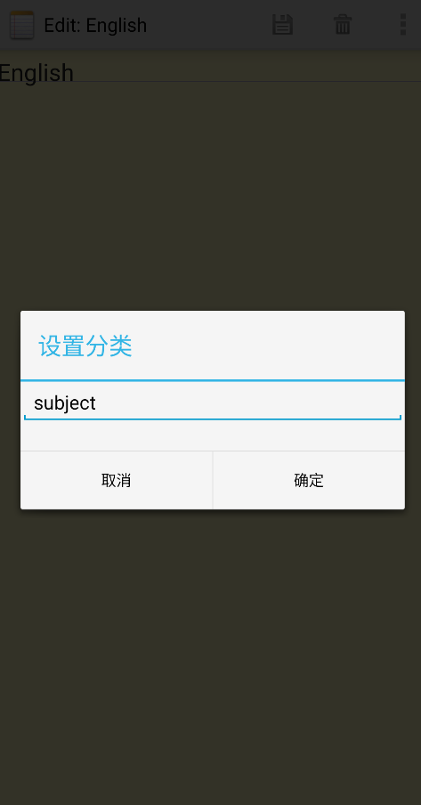 

##### 笔记的分类属性在主页显示

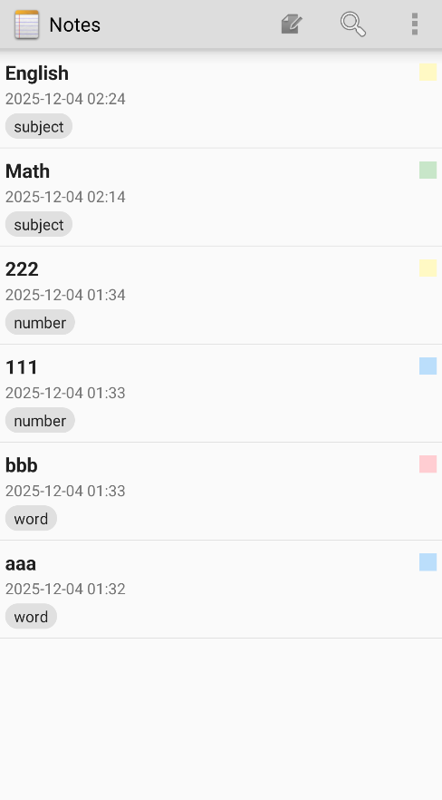
 ### （三）多重筛选功能
 ###  1. 功能说明
支持2种筛选方式：

按分类筛选

按颜色筛选

支持筛选条件组合
 ###  2. 技术实现步骤
 步骤一：实现筛选对话框（NotesList.java）
 ```java
private void showCategoryFilterDialog() {
    AlertDialog.Builder builder = new AlertDialog.Builder(this);
    builder.setTitle("选择分类");

    Cursor cursor = getContentResolver().query(
            NotePad.Notes.CONTENT_URI,
            new String[] { "DISTINCT " + NotePad.Notes.COLUMN_NAME_CATEGORY },
            NotePad.Notes.COLUMN_NAME_CATEGORY + " IS NOT NULL AND "
                    + NotePad.Notes.COLUMN_NAME_CATEGORY + " != ''",
            null,
            NotePad.Notes.COLUMN_NAME_CATEGORY + " ASC"
    );

    final List<String> categories = new ArrayList<>();
    categories.add("(全部)");
    categories.add("(新建分类...)");

    if (cursor != null) {
        while (cursor.moveToNext()) {
            String category = cursor.getString(0);
            if (category != null && !category.isEmpty()) {
                categories.add(category);
            }
        }
        cursor.close();
    }

    final CharSequence[] items = categories.toArray(new CharSequence[0]);

    builder.setItems(items, new DialogInterface.OnClickListener() {
        @Override
        public void onClick(DialogInterface dialog, int which) {
            if (which == 0) {
                mCurrentCategoryFilter = "";
                refreshList();
            } else if (which == 1) {
                showNewCategoryDialog();
            } else {
                mCurrentCategoryFilter = items[which].toString();
                refreshList();
            }
        }
    });

    builder.show();
}

private void showColorFilterDialog() {
    AlertDialog.Builder builder = new AlertDialog.Builder(this);
    builder.setTitle("选择颜色");

    final String[] colors = {"全部", "默认(白色)", "红色", "蓝色", "绿色", "黄色", "紫色"};
    final int[] colorValues = {-1, NotePad.Notes.COLOR_DEFAULT, NotePad.Notes.COLOR_RED,
            NotePad.Notes.COLOR_BLUE, NotePad.Notes.COLOR_GREEN,
            NotePad.Notes.COLOR_YELLOW, NotePad.Notes.COLOR_PURPLE};

    builder.setItems(colors, new DialogInterface.OnClickListener() {
        @Override
        public void onClick(DialogInterface dialog, int which) {
            mCurrentColorFilter = colorValues[which];
            refreshList();
        }
    });

    builder.show();
}
```
步骤二：实现组合筛选逻辑（NotesList.java）
```java
private void refreshList() {
    String selection = null;
    String[] selectionArgs = null;
    List<String> selectionList = new ArrayList<>();
    List<String> argsList = new ArrayList<>();

    // 搜索条件
    if (mCurrentSearchQuery != null && !mCurrentSearchQuery.isEmpty()) {
        selectionList.add("(" + NotePad.Notes.COLUMN_NAME_TITLE + " LIKE ? OR "
                + NotePad.Notes.COLUMN_NAME_NOTE + " LIKE ?)");
        argsList.add("%" + mCurrentSearchQuery + "%");
        argsList.add("%" + mCurrentSearchQuery + "%");
    }

    // 分类筛选条件
    if (mCurrentCategoryFilter != null && !mCurrentCategoryFilter.isEmpty()) {
        selectionList.add(NotePad.Notes.COLUMN_NAME_CATEGORY + " = ?");
        argsList.add(mCurrentCategoryFilter);
    }

    // 颜色筛选条件
    if (mCurrentColorFilter >= 0) {
        selectionList.add(NotePad.Notes.COLUMN_NAME_COLOR + " = ?");
        argsList.add(String.valueOf(mCurrentColorFilter));
    }

    if (!selectionList.isEmpty()) {
        selection = TextUtils.join(" AND ", selectionList);
        selectionArgs = argsList.toArray(new String[0]);
    }

    Cursor cursor = managedQuery(
            getIntent().getData(),
            PROJECTION,
            selection,
            selectionArgs,
            mCurrentSortOrder
    );

    SimpleCursorAdapter adapter = (SimpleCursorAdapter) getListAdapter();
    adapter.changeCursor(cursor);
    adapter.notifyDataSetChanged();
}
```
步骤三：添加筛选菜单项（NotesList.java）
```java
@Override
public boolean onCreateOptionsMenu(Menu menu) {
    MenuInflater inflater = getMenuInflater();
    inflater.inflate(R.menu.list_options_menu, menu);

    // 添加筛选菜单
    SubMenu filterSubMenu = menu.addSubMenu("筛选");
    filterSubMenu.add(0, 1004, 0, "按分类筛选");
    filterSubMenu.add(0, 1005, 1, "按颜色筛选");
    filterSubMenu.add(0, 1006, 2, "清除筛选");
    
    return super.onCreateOptionsMenu(menu);
}

@Override
public boolean onOptionsItemSelected(MenuItem item) {
    switch (id) {
        case 1004: // 按分类筛选
            showCategoryFilterDialog();
            return true;
        case 1005: // 按颜色筛选
            showColorFilterDialog();
            return true;
        case 1006: // 清除筛选
            clearSearch();
            return true;
    }
    return super.onOptionsItemSelected(item);
}
```
 ###  3. 效果截图
##### 可按笔记分类和颜色选择筛选条件

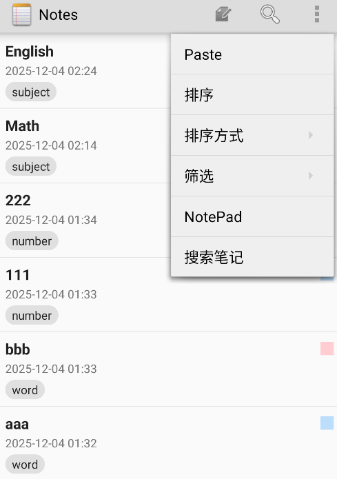    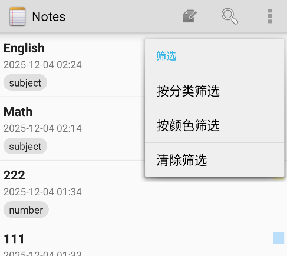
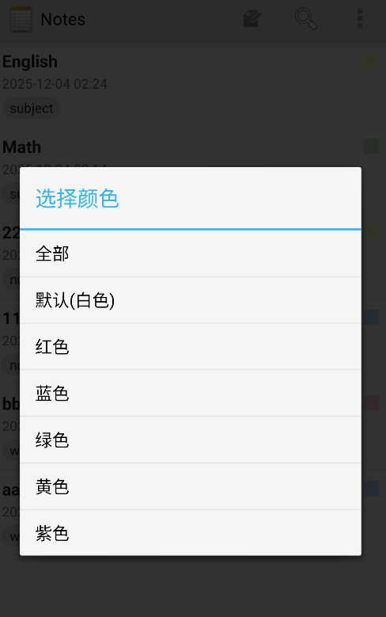    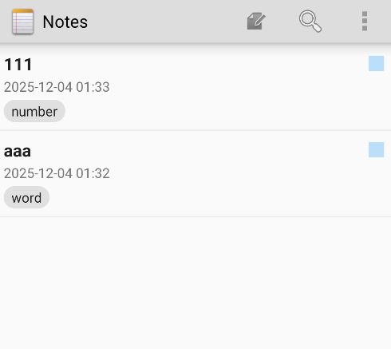
 ### （四）高级排序功能
 ###  1. 功能说明
支持4种排序方式：

按修改时间降序（最新在前）

按修改时间升序（最旧在前）

按标题字母顺序

按颜色分组排序
 ###  2. 技术实现步骤
 步骤一：实现排序功能（NotesList.java）
 ```java
// 排序菜单处理
@Override
public boolean onOptionsItemSelected(MenuItem item) {
    int id = item.getItemId();
    
    switch (id) {
        case 1001: // 按时间降序
            mCurrentSortOrder = NotePad.Notes.COLUMN_NAME_MODIFICATION_DATE + " DESC";
            refreshList();
            return true;
        case 1002: // 按时间升序
            mCurrentSortOrder = NotePad.Notes.COLUMN_NAME_MODIFICATION_DATE + " ASC";
            refreshList();
            return true;
        case 1003: // 按标题
            mCurrentSortOrder = NotePad.Notes.COLUMN_NAME_TITLE + " ASC";
            refreshList();
            return true;
        case 1007: // 按颜色排序
            mCurrentSortOrder = NotePad.Notes.COLUMN_NAME_COLOR + " ASC, " +
                    NotePad.Notes.COLUMN_NAME_MODIFICATION_DATE + " DESC";
            refreshList();
            return true;
    }
    return super.onOptionsItemSelected(item);
}
```
步骤二：添加排序菜单（NotesList.java）
```java
@Override
public boolean onCreateOptionsMenu(Menu menu) {
    MenuInflater inflater = getMenuInflater();
    inflater.inflate(R.menu.list_options_menu, menu);

    // 添加排序菜单
    SubMenu sortSubMenu = menu.addSubMenu("排序方式");
    sortSubMenu.add(0, 1001, 0, "按时间降序");
    sortSubMenu.add(0, 1002, 1, "按时间升序");
    sortSubMenu.add(0, 1003, 2, "按标题");
    sortSubMenu.add(0, 1007, 3, "按颜色");
    
    return super.onCreateOptionsMenu(menu);
}
```
步骤三：实现列表刷新方法（NotesList.java）
```java
private void refreshList() {
    // 构建查询条件...
    
    Cursor cursor = managedQuery(
            getIntent().getData(),
            PROJECTION,
            selection,
            selectionArgs,
            mCurrentSortOrder  // 使用当前排序方式
    );

    SimpleCursorAdapter adapter = (SimpleCursorAdapter) getListAdapter();
    adapter.changeCursor(cursor);
    adapter.notifyDataSetChanged();
}
```
步骤四：默认排序定义（NotePad.java）
```java
public static final class Notes implements BaseColumns {
    /**
     * The default sort order for this table
     */
    public static final String DEFAULT_SORT_ORDER = "modified DESC";
}
```
 ###  3. 效果截图
##### 支持4种排序方式：
按修改时间降序（最新在前），按修改时间升序（最旧在前），按标题，按颜色分组排序

 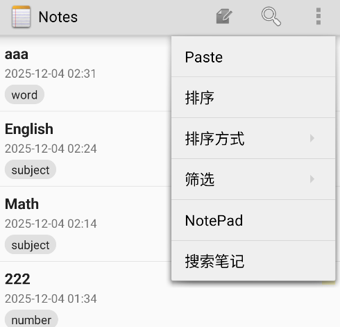 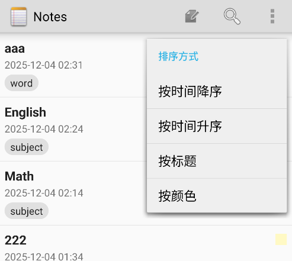

##### 按修改时间降序（最新在前）

 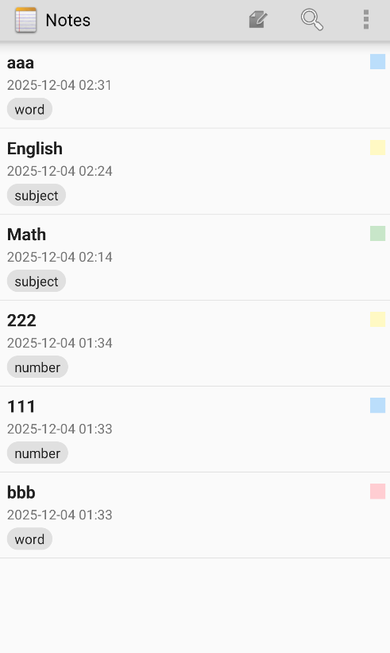

##### 按修改时间升序（最旧在前）

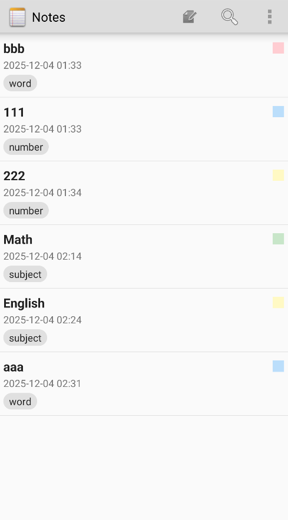

##### 按标题


##### 按颜色分组排序

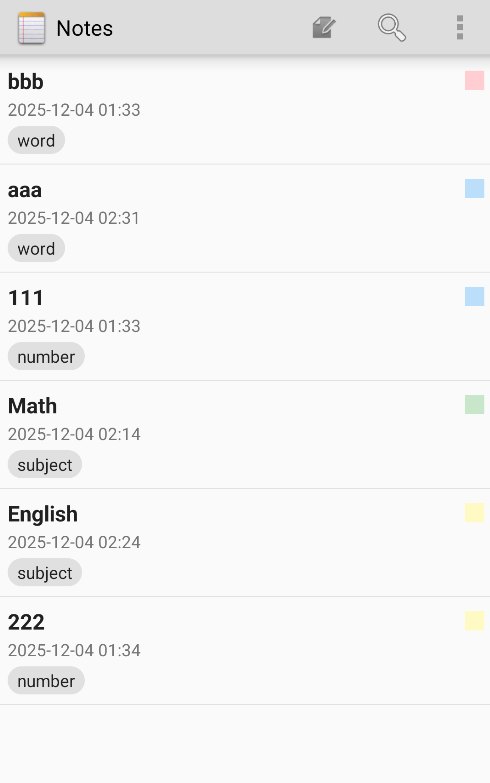
